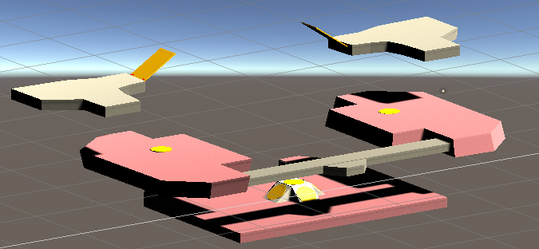
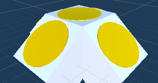
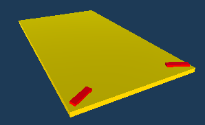
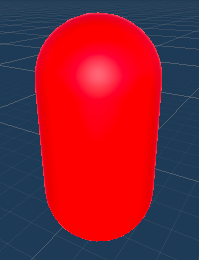

# Quake III Arena Training Simulator

- This is my attempt to create Quake III Arena with Unity.
- Learn level design to create the map of the game.
- Explore the usage of C# and Unity framework for game development.

## Rules

- Goal to shoot down all the target dummies
- Press ```a``` to go left, ```d``` to go right, ```s``` to go back, ```w``` to go forward, and press space to jump.
- Use your mouse to rotate the camera.
- [Check out the demo on YouTube](https://youtu.be/ECcJ5Ui4G9I)


## Game Map



## Functional Objects

|          Objects         | Name | Descriptions |
| ------------------------ | ------------- | ------- |
|  | Jumping Pad | Allow player to jump higher |
|  | Jumping Stand | Allow player to jump higher in any direction |
| | Speed Booster | Allow player to speed up |
|  | Training Dummy | Player can use it for shooting practice |

## To play the game

- Open this repo with Unity editor, and 
- Go to ```File``` --> ```Build Settings```
    - Select your favourite platform (I recommand PC, Mac & Linux Standalone) 
    - Create a folder (ex. ```Builds/```) to put the built game
    - Click ```Build and Run```, and have fun
- To quit the game, press ```ctrl + Q```

## Challenge

- Try to run around the map by using mostly jumping pads and speed boosters like this demo below
- [Challenge demo on Youtube](https://youtu.be/8Zo7IyL6aAc)